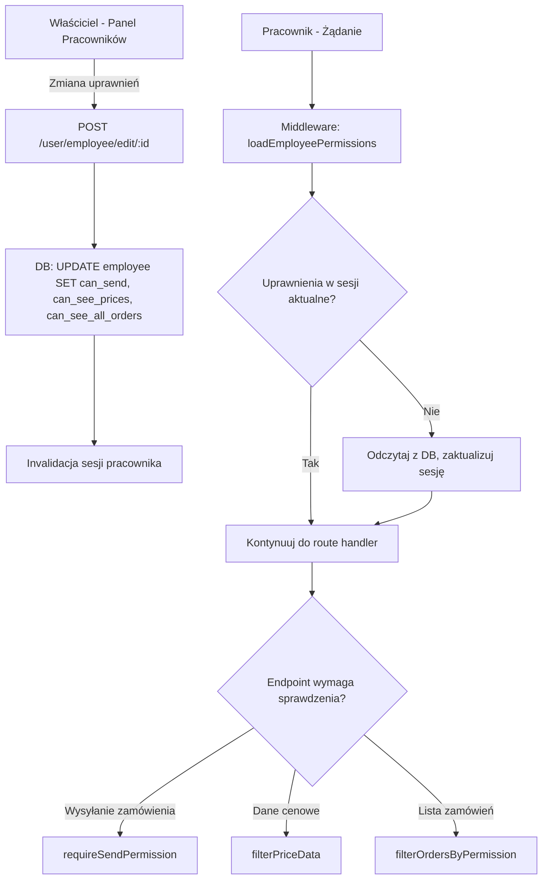

# Dokument Projektowy: Uprawnienia Pracowników

## Overview

System uprawnień pracowników rozszerza istniejący panel pracowników o trzy niezależne uprawnienia kontrolujące dostęp do kluczowych funkcjonalności: wysyłanie zamówień, widoczność cen oraz zakres widocznych zamówień. Uprawnienia przechowywane są w bazie danych jako kolumny tabeli `employee`, egzekwowane po stronie serwera przez middleware, a zarządzane przez właściciela konta z poziomu panelu pracowników.

Architektura opiera się na istniejących wzorcach aplikacji:
- Kolumny TINYINT w tabeli `employee` (zamiast osobnej tabeli) — prostota i wydajność
- Middleware Express sprawdzający uprawnienia z sesji przy każdym żądaniu
- Odświeżanie uprawnień w sesji po każdej zmianie przez właściciela
- Przełączniki (toggle switches) w formularzach edycji/tworzenia pracownika

## Architecture



## Components and Interfaces

### 1. Warstwa bazy danych (`db/users.js`)

Nowe funkcje do zarządzania uprawnieniami:

```javascript
// Pobierz uprawnienia pracownika
async function getEmployeePermissions(employeeId)
// Zwraca: { can_send_orders: 0|1, can_see_prices: 0|1, can_see_all_orders: 0|1 }

// Zaktualizuj uprawnienia pracownika
async function updateEmployeePermissions(employeeId, permissions)
// permissions: { can_send_orders: 0|1, can_see_prices: 0|1, can_see_all_orders: 0|1 }

// Pobierz uprawnienia po loginie pracownika (do logowania)
async function getEmployeePermissionsByLogin(login)
```

### 2. Middleware (`middleware/employeePermissions.js`)

```javascript
// Ładuje uprawnienia pracownika do sesji (jeśli brak lub nieaktualne)
function loadEmployeePermissions(req, res, next)

// Blokuje wysyłanie zamówień dla pracowników bez uprawnienia
function requireSendPermission(req, res, next)

// Filtruje dane cenowe z odpowiedzi dla pracowników bez uprawnienia
function filterPriceData(req, res, next)
```

### 3. Warstwa routingu (`routes/users.js`, `routes/orders.js`)

Modyfikacje istniejących endpointów:
- `POST /user/employee/add` — inicjalizacja uprawnień przy tworzeniu
- `POST /user/employee/edit/:id` — zapis uprawnień
- `GET /user/employee/edit/:id` — ładowanie aktualnych uprawnień do formularza
- `GET /user/employee-panel` — przekazanie uprawnień do widoku tabeli
- `POST /orders/send/:orderId` — sprawdzenie uprawnienia wysyłania
- `GET /orders/` i `GET /orders/history` — filtrowanie zamówień wg uprawnienia
- `GET /orders/order/:orderId` — sprawdzenie dostępu do szczegółów zamówienia

### 4. Warstwa widoków (templates)

- `templates/user/user_panel.njk` — dodanie kolumn uprawnień w tabeli
- `templates/user/edit_employee.njk` — dodanie przełączników uprawnień
- `templates/user/add_employee.njk` — dodanie przełączników z domyślnym stanem
- `templates/orders.njk` — warunkowe ukrywanie przycisku wysyłania i cen

### 5. Serwis autoryzacji (`services/authService.js`)

Modyfikacja `handleAuthLogin` — przy logowaniu pracownika ładowanie uprawnień do sesji:

```javascript
req.session.employeePermissions = {
    can_send_orders: employee.can_send_orders === 1,
    can_see_prices: employee.can_see_prices === 1,
    can_see_all_orders: employee.can_see_all_orders === 1
};
```

## Data Models

### Modyfikacja tabeli `employee`

```sql
ALTER TABLE employee
    ADD COLUMN can_send_orders TINYINT(1) NOT NULL DEFAULT 0,
    ADD COLUMN can_see_prices TINYINT(1) NOT NULL DEFAULT 0,
    ADD COLUMN can_see_all_orders TINYINT(1) NOT NULL DEFAULT 0;
```

**Uzasadnienie wyboru kolumn zamiast osobnej tabeli:**
- Trzy stałe uprawnienia (nie dynamiczne) — nie potrzeba elastyczności osobnej tabeli
- Jeden SELECT pobiera pracownika z uprawnieniami — brak dodatkowego JOIN
- Prostota migracji — ALTER TABLE zamiast CREATE TABLE + relacje
- Spójność z istniejącym wzorcem (tabela `employee` już zawiera wszystkie dane pracownika)

### Struktura danych w sesji

```javascript
req.session.employeePermissions = {
    can_send_orders: Boolean,    // true = może wysyłać zamówienia
    can_see_prices: Boolean,     // true = widzi ceny
    can_see_all_orders: Boolean  // true = widzi wszystkie zamówienia klienta
};
```

### Schemat odpowiedzi API uprawnień

```javascript
// GET /user/employee/edit/:id - rozszerzenie istniejącej odpowiedzi
{
    id: Number,
    name: String,
    surname: String,
    login: String,
    phone: String,
    can_send_orders: 0 | 1,
    can_see_prices: 0 | 1,
    can_see_all_orders: 0 | 1
}

// POST /user/employee/edit/:id - rozszerzenie body żądania
{
    name: String,
    surname: String,
    login: String,
    password?: String,
    phone?: String,
    can_send_orders: "0" | "1",
    can_see_prices: "0" | "1",
    can_see_all_orders: "0" | "1"
}
```

## Correctness Properties

*Właściwość (property) to cecha lub zachowanie, które powinno być prawdziwe we wszystkich poprawnych wykonaniach systemu — formalny opis tego, co system powinien robić. Właściwości stanowią pomost między specyfikacjami czytelnymi dla człowieka a gwarancjami poprawności weryfikowalnymi maszynowo.*

### Property 1: Niezależność uprawnień

*Dla dowolnego* pracownika i dowolnego stanu początkowego trzech uprawnień, zmiana wartości jednego uprawnienia nie powinna modyfikować wartości pozostałych dwóch uprawnień.

**Validates: Requirements 1.1**

### Property 2: Kaskadowe usuwanie uprawnień

*Dla dowolnego* pracownika z dowolnym stanem uprawnień, po usunięciu pracownika, zapytanie o jego uprawnienia powinno zwrócić pusty wynik (brak rekordu).

**Validates: Requirements 1.3**

### Property 3: Trwałość zapisu uprawnień

*Dla dowolnej* kombinacji wartości trzech uprawnień (8 możliwych stanów), po zapisie przez właściciela, odczyt uprawnień z bazy danych powinien zwrócić dokładnie te same wartości, które zostały zapisane.

**Validates: Requirements 2.3**

### Property 4: Egzekwowanie uprawnienia wysyłania zamówień

*Dla dowolnego* pracownika, wynik próby wysłania zamówienia przez API (sukces lub 403) powinien być równy stanowi jego uprawnienia `can_send_orders` — sukces gdy włączone, 403 gdy wyłączone.

**Validates: Requirements 3.1, 3.2, 3.4**

### Property 5: Egzekwowanie widoczności cen

*Dla dowolnego* pracownika i dowolnego zamówienia z cenami, obecność danych cenowych w odpowiedzi API powinna być równa stanowi uprawnienia `can_see_prices` — ceny obecne gdy włączone, pominięte gdy wyłączone.

**Validates: Requirements 4.1, 4.2, 4.4**

### Property 6: Filtrowanie widoczności zamówień

*Dla dowolnego* pracownika i dowolnego zbioru zamówień przypisanych do różnych pracowników tego samego właściciela: gdy `can_see_all_orders` jest wyłączone, zwrócone zamówienia powinny zawierać wyłącznie te z `employee_id` równym ID tego pracownika; gdy włączone, powinny zawierać wszystkie zamówienia właściciela.

**Validates: Requirements 5.1, 5.2, 5.4**

### Property 7: Wyłączność modyfikacji uprawnień przez właściciela

*Dla dowolnego* użytkownika, który nie jest właścicielem-twórcą danego pracownika (inny właściciel, inny pracownik, niezalogowany), próba modyfikacji uprawnień powinna zostać odrzucona z kodem 403, a stan uprawnień powinien pozostać niezmieniony.

**Validates: Requirements 6.1, 6.2**

## Error Handling

### Błędy bazy danych przy zapisie uprawnień

- Transakcja obejmuje zapis danych pracownika i uprawnień
- W przypadku błędu — rollback całej operacji
- Zwrot HTTP 500 z komunikatem `"Błąd podczas zapisywania uprawnień"`
- Logowanie błędu przez `log()` utility

### Błędy przy tworzeniu pracownika z uprawnieniami

- Ponieważ uprawnienia są kolumnami tabeli `employee`, tworzenie jest atomowe (jeden INSERT)
- Domyślne wartości `DEFAULT 0` gwarantują poprawny stan nawet bez jawnego ustawienia
- W przypadku błędu INSERT — cały rekord nie zostaje utworzony (atomowość MySQL)

### Błędy autoryzacji

| Scenariusz | Kod HTTP | Komunikat |
|---|---|---|
| Pracownik próbuje wysłać bez uprawnienia | 403 | `"Brak uprawnień do wysyłania zamówień"` |
| Pracownik próbuje zobaczyć cudze zamówienie | 403 | `"Brak uprawnień do tego zamówienia"` |
| Nie-właściciel próbuje zmienić uprawnienia | 403 | `"Brak uprawnień"` |
| Pracownik nie znaleziony | 404 | `"Pracownik nie znaleziony"` |

### Odświeżanie uprawnień w sesji

- Przy każdym żądaniu pracownika middleware sprawdza flagę `permissionsVersion` w sesji
- Gdy właściciel zmienia uprawnienia, inkrementuje wersję w bazie
- Middleware porównuje wersje i odświeża sesję gdy nieaktualna
- Alternatywnie (prostsze): middleware zawsze odczytuje uprawnienia z DB przy żądaniach do chronionych endpointów

**Wybrana strategia:** Odczyt z DB przy każdym żądaniu do chronionych endpointów. Uzasadnienie:
- Prostota implementacji (brak mechanizmu wersjonowania)
- Gwarancja aktualności (brak opóźnienia)
- Akceptowalny koszt (jeden lekki SELECT na żądanie)

## Testing Strategy

### Testy jednostkowe (example-based)

- Tworzenie pracownika z domyślnymi uprawnieniami (1.2, 3.6)
- Wyświetlanie przełączników w formularzu edycji (2.2)
- Wyświetlanie przełączników w formularzu tworzenia (2.5)
- Dezaktywacja przycisku wysyłania w UI (3.3)
- Ukrywanie cen w szczegółach zamówienia i PDF (4.3)
- Natychmiastowe działanie zmiany uprawnień bez re-loginu (3.5, 4.5, 6.5)
- Ładowanie uprawnień do sesji przy logowaniu (6.3)
- Obsługa błędu przy inicjalizacji uprawnień (1.4)
- Obsługa błędu przy zapisie uprawnień (2.4)

### Testy property-based

Biblioteka: **fast-check** (JavaScript/Node.js)

Konfiguracja: minimum 100 iteracji na test.

Każdy test oznaczony tagiem: **Feature: employee-permissions, Property {numer}: {opis}**

Testowane właściwości:
1. Niezależność uprawnień — generowanie losowych stanów, zmiana jednego, weryfikacja pozostałych
2. Kaskadowe usuwanie — tworzenie pracowników z losowymi uprawnieniami, usuwanie, weryfikacja braku danych
3. Trwałość zapisu — generowanie wszystkich 8 kombinacji stanów, zapis i odczyt
4. Egzekwowanie wysyłania — losowi pracownicy z losowym stanem uprawnienia, weryfikacja odpowiedzi API
5. Egzekwowanie widoczności cen — losowe zamówienia, losowy stan uprawnienia, weryfikacja obecności cen
6. Filtrowanie zamówień — losowe zbiory zamówień z różnymi employee_id, weryfikacja filtrowania
7. Wyłączność modyfikacji — losowi użytkownicy różnych typów, weryfikacja odrzucenia

### Testy integracyjne

- Pełny flow: logowanie pracownika → sprawdzenie uprawnień → wysłanie zamówienia
- Zmiana uprawnień przez właściciela → weryfikacja efektu na sesję pracownika
- Migracja bazy danych — weryfikacja że ALTER TABLE nie psuje istniejących danych
